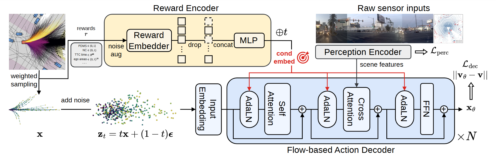
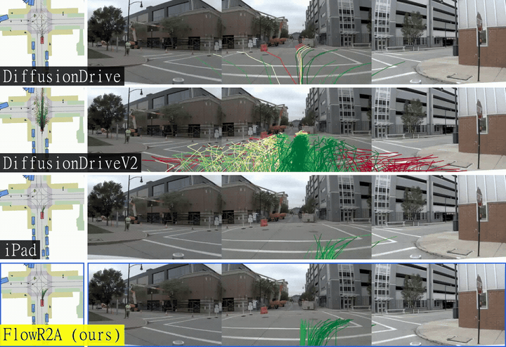
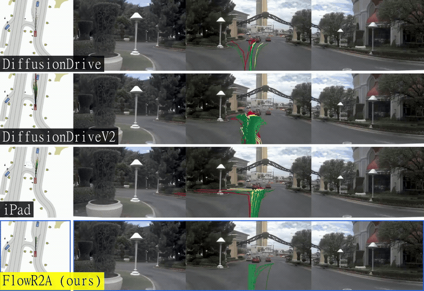

<div align="center">
<h1>FlowR2A: Learning Reward-to-Action Distribution for Multimodal Driving Planning</h1>

<a href="https://lixirui142.github.io/flowr2a-ad/"></a>
<a href="https://arxiv.org/abs/XXXX.XXXXX"></a>
<a href="https://huggingface.co/lixirui142/FlowR2A"></a>
[](LICENSE)

</div>

## Table of Contents
- [Overview](#overview)
- [Qualitative Results on NAVSIM](#qualitative-results-on-navsim)
- [Getting Started](#getting-started)
- [To-Do](#to-do)
- [Acknowledgement](#acknowledgement)
- [Citation](#citation)

## Overview
FlowR2A is a multimodal driving planner that learns the reward-conditioned action distribution *p(a | r)* with flow matching. Instead of treating simulation rewards as discriminative targets, FlowR2A treats them as a *condition*, unifying the dense supervision of scoring-based methods with the generative proposal modeling of anchor-based methods. At inference, generation is steered toward high-reward trajectories via classifier-free guidance.

<div align="center">

<p><b>Training pipeline of FlowR2A.</b></p>
</div>

## Qualitative Results on NAVSIM
Each row is one planner; trajectory proposals are colored by PDM score, from <b>red&nbsp;(0)</b> to <b>green&nbsp;(1)</b>. FlowR2A (bottom row) produces proposals that are both diverse and consistently high-scoring.

<div align="center">
  
  
</div>

> More qualitative comparisons are available on the [project page](https://lixirui142.github.io/flowr2a-ad/).

## Getting Started

- [Data and Environment Preparation](docs/install.md) — install dependencies and download the data/models needed for evaluation.
- [Evaluation](docs/evaluation.md) — download the pre-trained checkpoints and run evaluation on the test set.

## To-Do
- [x] Inference and evaluation code
- [ ] Training code
- [ ] Reward simulation / caching pipeline

## Acknowledgement
FlowR2A is built upon the following outstanding open-source contributions: [NAVSIM](https://github.com/autonomousvision/navsim), [DiffusionDrive](https://github.com/hustvl/DiffusionDrive).

## Citation
If you find FlowR2A useful in your research or applications, please consider giving us a star 🌟 and citing it with the following BibTeX entry.

```bibtex
@article{flowr2a2026,
  title         = {FlowR2A: Learning Reward-to-Action Distribution for Multimodal Driving Planning},
  author        = {Li, Xirui and Liu, Zhe and Ye, Xiaoqing and Han, Wenhua and Pan, Yifeng and Han, Junyu and Zhao, Hengshuang},
  journal       = {arXiv preprint arXiv:XXXX.XXXXX},
  year          = {2026}
}
```

## License
MIT — see [LICENSE](LICENSE).
